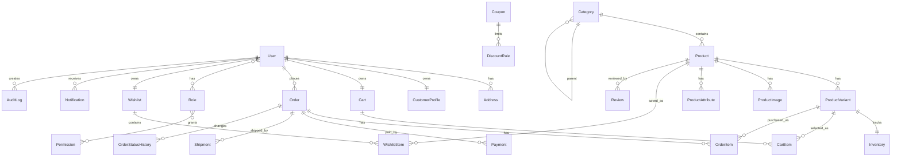

# مدل داده، ERD و DDL

## موجودیت‌های اصلی ERD

Accounts:

- User
- Role
- Permission
- CustomerProfile
- Address

Catalog:

- Category
- Product
- ProductVariant
- ProductImage
- ProductAttribute
- Inventory

Commerce:

- Cart
- CartItem
- Order
- OrderItem
- Payment
- Shipment
- OrderStatusHistory
- Coupon
- DiscountRule

Engagement:

- Wishlist
- WishlistItem
- Review

Content:

- BlogPost
- Page
- Banner

Operations:

- Notification
- AuditLog
- Setting

## رابطه‌های مهم

- `User 1---N Address`
- `User 1---N Order`
- `User 1---1 Cart`
- `Category 1---N Product`
- `Product 1---N ProductVariant`
- `Product 1---N ProductImage`
- `ProductVariant 1---1 Inventory`
- `Cart 1---N CartItem`
- `Order 1---N OrderItem`
- `Order 1---N Payment`
- `Order 1---N Shipment`
- `Order 1---N OrderStatusHistory`
- `User N---N Role`
- `Role N---N Permission`

## ERD نسخه 1



## statusها و enumهای نسخه 1

Product:

- `draft`
- `active`
- `archived`

Order:

- `draft`
- `pending_payment`
- `paid`
- `processing`
- `shipped`
- `delivered`
- `cancelled`
- `refunded`

Payment:

- `pending`
- `succeeded`
- `failed`
- `refunded`

Shipment:

- `pending`
- `ready`
- `shipped`
- `delivered`
- `returned`

Review:

- `pending`
- `approved`
- `rejected`

## نکات طراحی دیتابیس

- شناسه‌ها بهتر است `UUID` باشند.
- `slug` برای صفحات public باید unique باشد.
- مبلغ‌ها با `NUMERIC(12,2)` ذخیره شوند.
- وضعیت‌ها باید enum-like و محدود باشند.
- همه جدول‌های عملیاتی باید `created_at` و `updated_at` داشته باشند.
- برای موجودی، سفارش و پرداخت باید constraintها سخت‌گیرانه باشند.

## DDL اولیه نمونه

```sql
CREATE TABLE users (
    id UUID PRIMARY KEY DEFAULT gen_random_uuid(),
    email VARCHAR(255) UNIQUE NOT NULL,
    phone VARCHAR(20) UNIQUE,
    password_hash TEXT NOT NULL,
    first_name VARCHAR(100),
    last_name VARCHAR(100),
    is_active BOOLEAN NOT NULL DEFAULT TRUE,
    is_staff BOOLEAN NOT NULL DEFAULT FALSE,
    created_at TIMESTAMPTZ NOT NULL DEFAULT NOW(),
    updated_at TIMESTAMPTZ NOT NULL DEFAULT NOW()
);

CREATE TABLE categories (
    id UUID PRIMARY KEY DEFAULT gen_random_uuid(),
    parent_id UUID REFERENCES categories(id) ON DELETE SET NULL,
    title VARCHAR(150) NOT NULL,
    slug VARCHAR(180) UNIQUE NOT NULL,
    description TEXT,
    is_active BOOLEAN NOT NULL DEFAULT TRUE,
    sort_order INT NOT NULL DEFAULT 0,
    created_at TIMESTAMPTZ NOT NULL DEFAULT NOW(),
    updated_at TIMESTAMPTZ NOT NULL DEFAULT NOW()
);

CREATE TABLE products (
    id UUID PRIMARY KEY DEFAULT gen_random_uuid(),
    category_id UUID REFERENCES categories(id) ON DELETE SET NULL,
    title VARCHAR(200) NOT NULL,
    slug VARCHAR(220) UNIQUE NOT NULL,
    short_description TEXT,
    long_description TEXT,
    status VARCHAR(30) NOT NULL DEFAULT 'draft',
    seo_title VARCHAR(255),
    seo_description VARCHAR(320),
    created_at TIMESTAMPTZ NOT NULL DEFAULT NOW(),
    updated_at TIMESTAMPTZ NOT NULL DEFAULT NOW()
);

CREATE TABLE product_variants (
    id UUID PRIMARY KEY DEFAULT gen_random_uuid(),
    product_id UUID NOT NULL REFERENCES products(id) ON DELETE CASCADE,
    sku VARCHAR(80) UNIQUE NOT NULL,
    color VARCHAR(80),
    material VARCHAR(100),
    size VARCHAR(80),
    price NUMERIC(12,2) NOT NULL,
    compare_at_price NUMERIC(12,2),
    is_active BOOLEAN NOT NULL DEFAULT TRUE,
    created_at TIMESTAMPTZ NOT NULL DEFAULT NOW(),
    updated_at TIMESTAMPTZ NOT NULL DEFAULT NOW()
);

CREATE TABLE inventory (
    id UUID PRIMARY KEY DEFAULT gen_random_uuid(),
    variant_id UUID UNIQUE NOT NULL REFERENCES product_variants(id) ON DELETE CASCADE,
    quantity INT NOT NULL DEFAULT 0,
    low_stock_threshold INT NOT NULL DEFAULT 3,
    updated_at TIMESTAMPTZ NOT NULL DEFAULT NOW(),
    CONSTRAINT inventory_quantity_non_negative CHECK (quantity >= 0)
);
```

## کارهای بعدی این سند

- تکمیل DDL برای همه جدول‌های عملیاتی از روی migrationهای Django.
- اضافه کردن indexهای تکمیلی بعد از بررسی queryهای واقعی.
- تبدیل ERD به DBML در صورت نیاز به ابزارهای دیتابیس.
